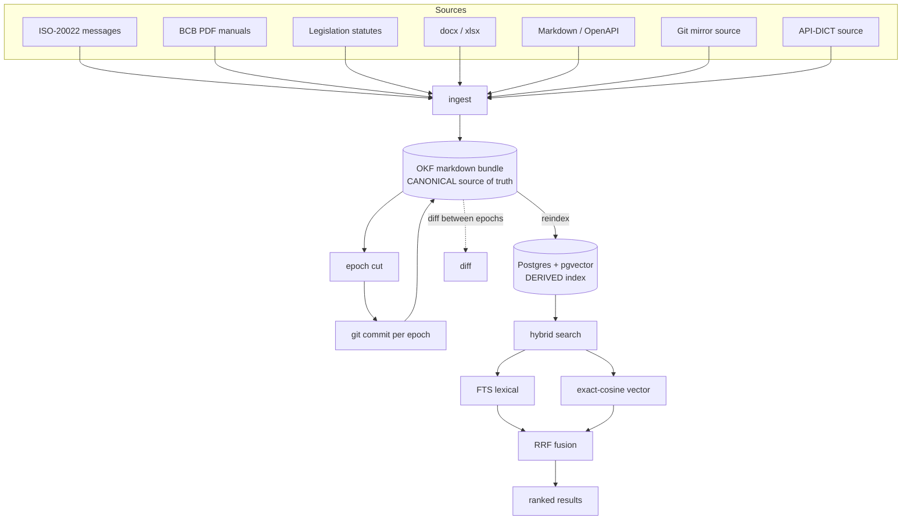

# pixkb Architecture
<!-- rev:002 -->

`pixkb` is an air-gap knowledge base for Brazil BCB Pix/SPB. The **OKF
(Open Knowledge Format) markdown bundle is the canonical source of truth**;
everything in Postgres is a derived, rebuildable index.

## Flow

The CLI surfaces these stages as commands: `ingest`, `reindex`, `search`,
`diff`, `watch`, `serve`, `doctor`, `export-bundle`, and `db`.

## Bitemporal model

Derived facts are stored in `concept_fact` with two independent time axes:

- **Valid time** — when a fact is true in the BCB domain (the epoch / version
  of the spec it describes).
- **Transaction time** — when the fact was recorded in the store (which ingest
  run / commit produced it).

This lets the KB answer both "what did the spec say as of epoch N" and "what did
*our index* believe at a given point", and makes reindexing non-destructive:
re-deriving the store from the canonical bundle reproduces the same facts.

## Canonical vs derived split

| Aspect        | OKF markdown bundle (canonical) | Postgres + pgvector (derived) |
|---------------|---------------------------------|-------------------------------|
| Role          | Source of truth                 | Query/index accelerator       |
| Versioning    | Git, one commit per epoch        | Rebuilt via `reindex`         |
| Durability    | Must be preserved                | Disposable / regenerable      |
| Content       | Concepts, sections, front-matter | FTS + typed vectors, `concept_fact` |

Because the index is fully derived, the air-gap deployment only needs to ship
and preserve the bundle; the Postgres index can always be rebuilt from it with
`reindex`. Search combines the lexical FTS ranking and the exact-cosine vector
ranking, fusing them with Reciprocal Rank Fusion (RRF).
