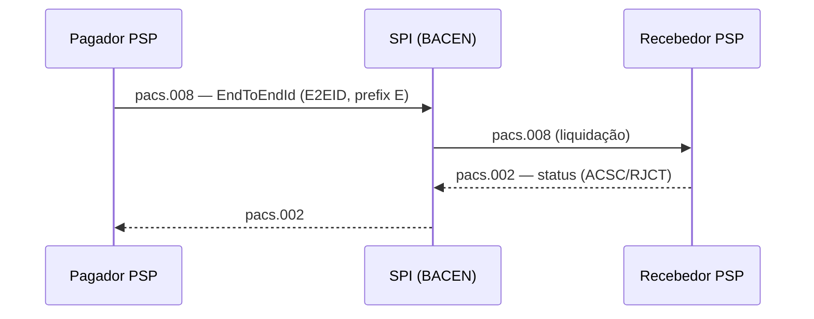
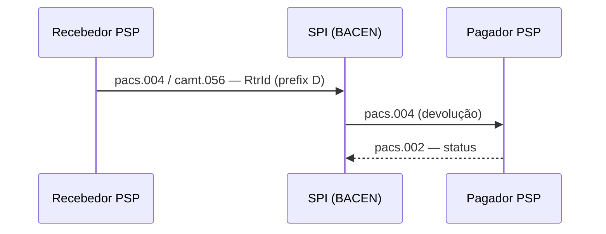

# BACEN Pix Flows & pixkb Pipeline

Canonical BACEN view of the Pix/SPB flows — the normative arrangement, not any
single participant's implementation. Actors are the BACEN roles only: **Pagador
PSP**, **Recebedor PSP**, **SPI** (settlement), **DICT** (key directory). Editable
diagrams (`bacen-flows.drawio`, `pixkb-pipeline.drawio`) export to SVG/PNG.

## Pix payment flow (pix-in)

An original Pix is carried as ISO 20022 **pacs.008** (FI to FI Customer Credit
Transfer). The Pagador PSP instructs the **SPI** (Sistema de Pagamentos
Instantâneos, settling over reserves accounts), which relays it to the Recebedor
PSP. Settlement status returns as **pacs.002** (`ACSC` settled, `RJCT` rejected).
The transaction carries an **EndToEndId (E2EID)** — 32 chars, prefix `E` — issued
once by the originating PSP.

## Devolução / refund flow

A refund (devolução) is carried as **pacs.004** (Payment Return) and/or
**camt.056** (Payment Cancellation Request), settled back through the SPI. It
carries an **RtrId** — 32 chars, prefix `D` — issued by the refunding PSP. One Pix
can have multiple `RtrId`s (partial refunds).

## DICT key resolution

Before initiating a Pix by key, the Pagador PSP resolves it against **DICT**
(Diretório de Identificadores de Contas Transacionais) via `GET /entries/{Key}`.
Key ownership transfers go through claims / reivindicação flows.

## Cobrança lifecycle

Charges are created through the Pix cobrança API (`POST /cob` immediate, `/cobv`
due-dated), producing a dynamic QR Code / Pix Copia e Cola payload that triggers
the pix-in flow; status is delivered to the merchant via a registered webhook.

## pixkb pipeline

pixkb ingests heterogeneous sources through GatherAll + CrossLink into the Epoch
Runner, which writes the canonical OKF bundle (`kb-data/`, git source of truth)
and the derived Postgres + pgvector index. Query is hybrid (title-weighted FTS +
vector KNN, RRF). An eval loop (Codex-as-judge) scores relevance/precision and
feeds fixes back. Agents reach the KB only through pixkb's MCP verbs.
